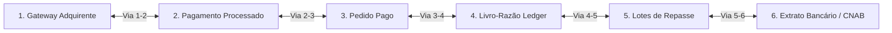
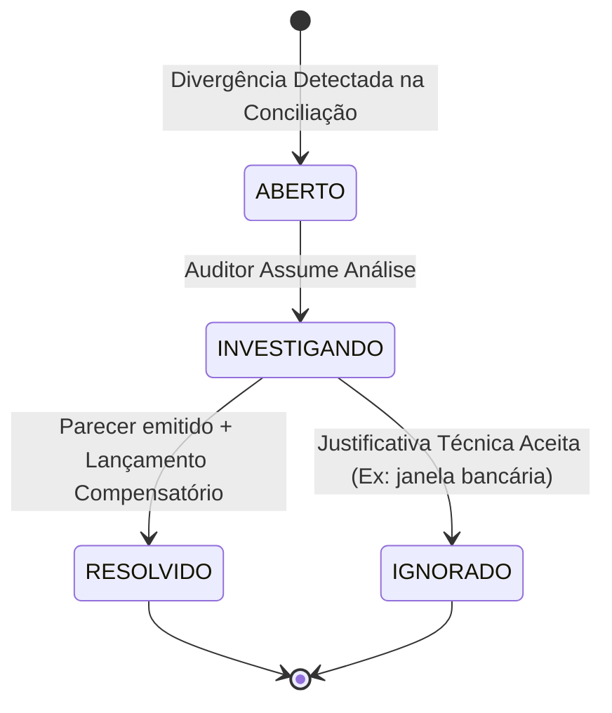

# EDDIE 11.19 — CENTRAL DE CONCILIAÇÃO 6 VIAS & CASOS DE DIVERGÊNCIA

> **Especificação de Auditoria & Reconciliação Contábil**  
> **Status:** HOMOLOGADO  
> **Data:** 25 de Setembro de 2026  
> **Escopo:** Módulo Financeiro & Compliance

---

## 1. Matriz de Conciliação 6 Vias

A conciliação do ecossistema DiskIngressos não se limita a comparar saldo de banco com relatório do gateway. O motor financeiro executa a **conferência contínua de 6 vias integradas**:



### Pontos de Conferência:
1. **Via 1 — Gateway Adquirente:** Total bruto capturado nos provedores (Cielo, Rede, Pix SPI).
2. **Via 2 — Pagamentos Registrados:** Total de transações com status `CONFIRMADO` no módulo de pagamentos.
3. **Via 3 — Pedidos Faturados:** Somatório dos pedidos de ingressos no módulo de pedidos com status `PAGO`.
4. **Via 4 — Ledger Imutável:** Lançamentos contábeis a crédito nas contas de custódia e caixas de liquidação.
5. **Via 5 — Lotes de Repasse (Settlement):** Total de valores programados e liquidados destinados ao produtor.
6. **Via 6 — Extrato Bancário Efetivo:** Comprovantes bancários de retorno CNAB 240 e IDs Pix ponta a ponta (`EndToEndId`).

---

## 2. Tipologia de Divergências & Severidade

| Tipo | Descrição Operacional | Severidade | Ação Automática | Ação Humana / Auditor |
|---|---|---|---|---|
| `DIVERGENCIA_ARREDONDAMENTO` | Diferença de 1 a 2 centavos em splits percentuais complexos. | BAIXA | Absorção pela conta de ajuste de centavos da Disk. | Registro em relatório de auditoria mensal. |
| `DIVERGENCIA_LIQUIDACAO` | Pedido marcado como pago no gateway, mas sem baixa confirmada no Ledger. | ALTA | Disparo de retentativa e bloqueio de emissão de ingresso. | Investigação imediata da fila de webhooks. |
| `REJEICAO_BANCARIA_CNAB` | Lote de repasse rejeitado pelo banco por conta encerrada ou chave Pix incorreta. | ALTA | Reversão do lote, estorno para o bucket `disponivel` e abertura de caso. | Notificação do produtor para recadastro da chave Pix. |
| `CHARGEBACK_NAO_PROVISIONADO` | Notificação adquirente de chargeback recebida sem saldo suficiente em reserva. | CRITICA | Bloqueio cautelar de novos repasses até recomposição do fundo. | Contato com o produtor e defesa jurídica no prazo adquirente. |
| `DIVERGENCIA_TEMPO_EXECUCAO` | Transação em voo entre o gateway e o banco durante o fechamento do dia. | MEDIA | Reavaliação automática na janela D+1. | Acompanhamento do fechamento contábil. |

---

## 3. Workflow de Resolução de Casos

Os casos de divergência são geridos através dos endpoints:
- `GET /api/eventos/:eventId/finance/reconciliation/cases` (Listagem com filtros)
- `PATCH /api/eventos/:eventId/finance/reconciliation/cases/:id` (Parecer e Encerramento)



### Campos Obrigatórios para Resolução:
- `caseId`: Identificador único do caso de conciliação.
- `action`: `RESOLVER` ou `IGNORAR`.
- `resolutionNote`: Parecer formal do auditor contábil (mínimo de 10 caracteres).
- `resolvedBy`: ID do usuário autenticado responsável pela decisão.
- `compensatoryEntryId`: Referência ao lançamento compensatório no Ledger, caso tenha havido movimentação financeira.
- `resolvedAt`: Timestamp ISO 8601 em UTC.

---

## 4. Auditoria Imutável de Casos

Toda alteração de estado em casos de conciliação gera evento de auditoria imutável:
- Evento emitido: `RECONCILIATION_RESOLVED`
- Gravação no Outbox:
  ```json
  {
    "eventId": "evt-rec-98214",
    "eventType": "RECONCILIATION_RESOLVED",
    "payload": {
      "caseId": "CASE-2026-09-001",
      "resolutionNote": "Lote CNAB reenviado com sucesso após retificação de dados bancários",
      "action": "RESOLVER",
      "resolvedBy": "usr-auditor-contabil-01"
    }
  }
  ```
