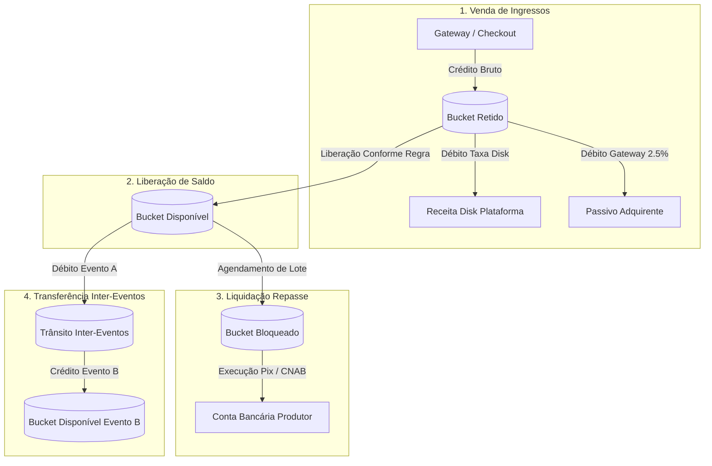

# EDDIE 11.19 — MAPA DO LIVRO-RAZÃO IMUTÁVEL (LEDGER)

> **Documento de Engenharia & Arquitetura Contábil**  
> **Status:** HOMOLOGADO  
> **Data:** 25 de Setembro de 2026  
> **Escopo:** Monólito Modular DiskIngressos PDT — Bounded Context `financeiro`

---

## 1. Princípios Invioláveis da Soberania do Ledger

1. **Fonte Única da Verdade Financeira:**
   - O Ledger imutável é o **único registrador contábil e financeiro** do sistema.
   - Nenhuma métrica analítica de marketing, BI ou Command Center (11.18) tem autoridade sobre saldos, DRE ou contas bancárias.
2. **Imutabilidade e Append-Only:**
   - As tabelas de lançamentos contábeis (`lancamentoLedger` / `LancamentoContabil`) operam em modo **estritamente append-only**.
   - `UPDATE` e `DELETE` em lançamentos contábeis são **estritamente proibidos por código e por triggers de banco**.
3. **Mecanismo de Correção via Lançamento Compensatório:**
   - Toda correção de erro operacional, estorno de transferência ou renegociação é feita **exclusivamente por um lançamento compensatório inverso**, mantendo a rastreabilidade integral da auditoria.
4. **Partidas Dobradas (Double-Entry Bookkeeping):**
   - Para cada débito em uma conta ou bucket, há um crédito correspondente em outra conta ou bucket, garantindo que o balanço patrimonial e a equação fundamental do patrimônio permaneçam sempre em equilíbrio (`Ativo = Passivo + Patrimônio Líquido`).
5. **Cálculo Derivado de Saldo:**
   - Não existe coluna mutável `saldo_atual` em tabelas do banco. O saldo real de um evento ou produtor é **calculado sob demanda** como:
     $$\text{Saldo Bucket} = \sum (\text{Lançamentos Entrada}) - \sum (\text{Lançamentos Saída})$$

---

## 2. Estrutura dos Buckets Financeiros do Evento

Cada evento possui uma árvore segregada de contas e buckets no Ledger:

| Bucket | Finalidade Contábil | Natureza | Bloqueio de Retirada |
|---|---|---|---|
| `disponivel` | Recursos liberados para repasse bancário Pix/TED, transferências inter-eventos ou liquidação de contas a pagar de fornecedores. | Crédito Líquido | Livre para movimentação imediata. |
| `retido` | Recursos recebidos de vendas de ingressos mantidos em custódia cautelar até a realização e conclusão das sessões do evento. | Custódia Cautelar | Bloqueado até a liberação de lote ou regra D+X. |
| `bloqueado` | Recursos provisionados para liquidação em lotes de repasse agendados ou em processamento bancário (Pix/CNAB 240). | Reserva de Liquidação | Cautelarmente indisponível para outras operações. |
| `reservado_estorno` | Fundo de reserva e compensações de estornos/chargebacks decorrentes de contestações adquirentes ou CDC 7 dias. | Provisão para Perdas | Deduzido do saldo total ou acionado em disputas. |
| `operacional` | Contas de despesas, contas a pagar de fornecedores homologados e custos de infraestrutura do evento. | Passivo Circulante | Baixado no momento da liquidação efetiva. |

---

## 3. Matriz de Partidas Dobradas por Transação

### Regras Contábeis Detalhadas:

1. **Venda Confirmada (Checkout):**
   - **Débito:** Ativo Circulante / Adquirente (Valor Bruto da Venda)
   - **Crédito:** Passivo Custódia Evento / Bucket `retido` (Valor Bruto)
   - **Débito:** Passivo Custódia Evento / Bucket `retido` (Taxa Disk snapshot)
   - **Crédito:** Receita Operacional DiskIngressos (Taxa Disk snapshot)

2. **Agendamento de Lote de Repasse (Settlement):**
   - **Débito:** Bucket `disponivel` do Evento
   - **Crédito:** Bucket `bloqueado` do Evento
   - *Garantia:* O valor deixa de estar disponível imediatamente, impossibilitando saques duplicados ou estornos descobertos.

3. **Liquidação Efetiva no Banco (Comprovante Pix/CNAB):**
   - **Débito:** Bucket `bloqueado` do Evento
   - **Crédito:** Caixa / Bancos Conta Movimento
   - *Comprovante:* Armazenamento do `bankReceiptId` e `pixEndToEndId` anexados imutavelmente ao lançamento.

4. **Transferência Inter-Eventos (Mesmo Produtor):**
   - **Evento Origem:** Débito no bucket `disponivel`
   - **Conta Transitória:** Crédito em conta de compensação de repasse interno
   - **Evento Destino:** Crédito no bucket `disponivel`
   - *Multi-Tenant:* Operações entre produtores diferentes são bloqueadas com `ForbiddenException` antes de qualquer lançamento contábil.

5. **Reversão Compensatória de Transferência:**
   - **Evento Destino:** Débito compensatório no bucket `disponivel`
   - **Evento Origem:** Crédito compensatório no bucket `disponivel`
   - *Histórico:* Referência cruzada imutável apontando para o `transferId` original.

---

## 4. Integração com Command Center 11.18 & Outbox

Todas as mutações do Ledger persistem registros no Outbox transacional (`platform.outbox`), disparando eventos no tópico `domain.events`:

- `FINANCIAL_BALANCE_CHANGED` -> Atualiza KPIs e visões do Command Center sem escrita direta.
- `SETTLEMENT_SCHEDULED` -> Reserva saldo e atualiza agenda de repasses.
- `PAYOUT_EXECUTED` -> Registra liquidação bancária concluída.
- `TRANSFER_COMPLETED` -> Atualiza extrato de ambos os eventos.
- `RECONCILIATION_DIVERGENCE` -> Aciona alerta com severidade no Cockpit e abre caso na auditoria.
- `CHARGEBACK_REVERSED` -> Notifica reversão de perda financeira no painel do produtor.
