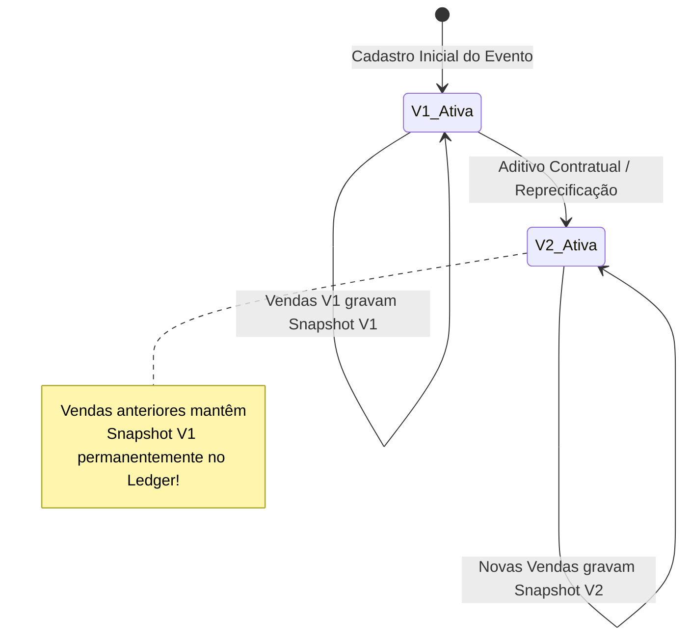

# EDDIE 11.19 — MOTOR DE TAXAS DISKINGRESSOS POR EVENTO & SNAPSHOT HISTÓRICO

> **Especificação Comercial & Contábil**  
> **Status:** HOMOLOGADO  
> **Data:** 25 de Setembro de 2026  
> **Escopo:** Módulo Financeiro & Comercial

---

## 1. Regra Fundamental: Ausência de Taxa Global

No ecossistema DiskIngressos, **não existe taxa global unificada**.
Cada evento opera sob condições comerciais customizadas, definidas em contrato bilateral entre a DiskIngressos e o Produtor/Organizador.

### Princípios da Regra:
1. **Precificação Individual por Evento:**
   - Eventos de grande porte com bilheterias expressivas podem ter taxas negociadas em percentuais menores (ex: 8.0%), taxas fixas por ingresso (ex: R$ 3,50) ou contratos híbridos.
2. **Preservação de Snapshot Histórico:**
   - Toda venda realizada consolida e grava um **snapshot imutável** da regra aplicada no exato instante da confirmação do pagamento.
   - A criação de uma nova versão de taxa para o evento (ex: transição de V1 para V2) **não altera e jamais recalcula vendas anteriores**.
3. **Imutabilidade Contábil:**
   - O saldo acumulado no Ledger histórico reflete estritamente a soma dos snapshots aplicados.

---

## 2. Modelos de Cobrança Suportados

| Modelo | Parâmetros | Fórmula de Cálculo da Taxa Disk | Exemplo de Aplicação |
|---|---|---|---|
| `PERCENTUAL` | `percentRate` (%) | $\text{Taxa Disk} = \text{round}\left(\frac{\text{GMV} \times \text{percentRate}}{100}\right)$ | Ingresso de R$ 100,00 com taxa de 10% = R$ 10,00 da Disk, R$ 90,00 do Produtor. |
| `FIXA` | `fixedAmountCents` (R$) | $\text{Taxa Disk} = \text{fixedAmountCents} \times \text{qtdeIngressos}$ | Ingresso de R$ 200,00 com taxa fixa de R$ 5,00 = R$ 5,00 da Disk, R$ 195,00 do Produtor. |
| `HIBRIDA` | `percentRate` + `fixedAmountCents` | $\text{Taxa Disk} = \text{round}\left(\frac{\text{GMV} \times \text{percentRate}}{100}\right) + (\text{fixedAmountCents} \times \text{qtde})$ | Ingresso de R$ 100,00 com 5% + R$ 2,00 = R$ 7,00 da Disk, R$ 93,00 do Produtor. |

---

## 3. Estrutura do Snapshot Histórico de Taxa

No momento da liquidação da venda no checkout, o serviço `FinancialEngineService` invoca `recordSaleWithFeeSnapshot` e persiste o seguinte objeto:

```typescript
export interface FeeSnapshot {
  ruleModel: 'PERCENTUAL' | 'FIXA' | 'HIBRIDA';
  appliedRatePercent?: number;       // Ex: 10.0
  appliedFixedCents?: number;        // Ex: 500
  diskFeeCents: number;              // Valor retido pela DiskIngressos
  gatewayFeeCents: number;           // Custo de processamento adquirente (2.5%)
  producerNetCents: number;          // Valor líquido destinado ao Produtor
  contractVersion: number;           // Ex: 1 (Versão da regra na data da compra)
  contractReference: string;         // Ex: 'CTR-2026-FESTIVAL-LIVE'
  calculatedAt: string;              // ISO 8601 em UTC
}
```

---

## 4. Ciclo de Vida & Versionamento de Regras



### Regras de Transição:
1. **Cadastro da Nova Versão:**
   - O endpoint `POST /api/eventos/:eventId/finance/fees` incrementa automaticamente a versão (`V1` -> `V2` -> `V3`).
   - A versão anterior tem seu status alterado para `HISTORICA` ou `SUBSTITUIDA`.
2. **Isolamento de Vendas Passadas:**
   - O teste automatizado no cenário 2 do E2E (`financial-intelligence.spec.ts`) valida explicitamente que após alterar a taxa de 10% (V1) para R$ 5,00 fixos (V2), os saldos gerados pelas vendas do período V1 permanecem inalterados.

---

## 5. Taxas de Spread & Advanced (Antecipação de Recebíveis)

Para operações de antecipação financeira solicitadas pelo produtor:

- **Fórmula de Deságio Pró-Rata Dia:**
  $$\text{Deságio} = \text{round}\left( \text{Valor Bruto} \times \frac{\text{Taxa Mensal}}{30 \times 100} \times \text{Dias Antecipados} \right)$$
- **Valor Líquido Creditado:**
  $$\text{Valor Líquido} = \text{Valor Bruto} - \text{Deságio}$$
- **Lançamento Contábil:**
  - Débito em custódia `retido` pelo valor bruto antecipado.
  - Crédito em receita financeira de spread da plataforma pelo deságio retido.
  - Crédito no bucket `disponivel` do produtor pelo valor líquido antecipado.
