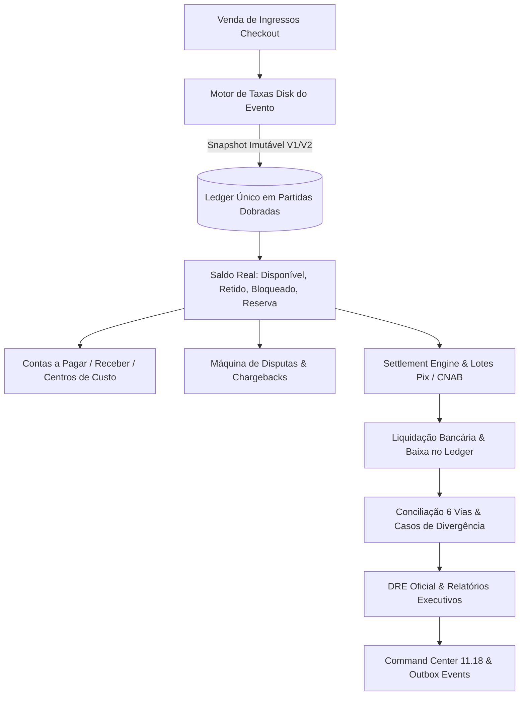

# EDDIE 11.19 — RELATÓRIO FINAL DE HOMOLOGAÇÃO
## Camada Financeira Especializada — ULTRA COMPLETO

> **Status:** HOMOLOGADO  
> **Data:** 25 de Setembro de 2026  
> **Repositório:** `viniciuscasagrande-creator/EDDIE` (`main`)  
> **Módulos Centrais:** `financeiro`, `contabilidade`, `operacao`, `apps/pdt`, `packages/contracts`

---

## 1. Resumo Executivo & Continuidade Arquitetural

O pacote **EDDIE 11.19 — ULTRA COMPLETO — Camada Financeira Especializada** consolida em definitivo o sistema operacional financeiro do ecossistema DiskIngressos. Partindo do **EDDIE 11.18 (Command Center)**, que estabeleceu o monitoramento em tempo real da operação sem criar fontes de dados duplicadas, o 11.19 implementa a autoridade máxima, especializada e imutável de finanças, conciliação e liquidação.

### Princípios Arquiteturais Invioláveis Homologados:
1. **Soberania do Ledger Único:** O Livro-Razão (`lancamentoLedger`) é a única fonte da verdade contábil. Métricas de marketing analítico ou dashboards não alteram saldo, DRE ou contas a pagar.
2. **Imutabilidade e Append-Only:** `UPDATE` e `DELETE` são estritamente bloqueados em lançamentos contábeis. Toda e qualquer retificação é efetuada por lançamentos compensatórios espelhados.
3. **Ausência de Taxa Global:** Cada evento possui sua regra comercial (percentual, fixa ou híbrida), mantendo o snapshot imutável gravado no momento da venda. Mudanças futuras de taxa jamais modificam vendas passadas.
4. **Isolamento Multi-Tenant:** Transferências e consultas entre produtores distintos são sumariamente rejeitadas com `ForbiddenException`.
5. **Inteligência sem Autonomia Financeira:** Diagnósticos inteligentes recomendam ações fundamentadas em dados, mas nunca movimentam dinheiro sem aprovação por alçada.

---

## 2. Mapa do Fluxo Fim a Fim Homologado



---

## 3. Componentes Implementados & Homologados

### 3.1 Backend & Modelos de Dados
- **Tipagem Canônica (`financial-engine.types.ts`):** Definições estritas de `EventFeeConfig`, `FeeSnapshot`, `EventRealBalanceDto`, `PayableDto`, `ReceivableDto`, `CostCenterDto`, `SupplierDto`, `TreasuryAccountDto`, `CnabBatchDto`, `RefundRecordDto`, `ChargebackRecordDto`, `FinancialReportDto`.
- **Serviço Especializado (`financial-engine.service.ts`):**
  - Motor de taxas por evento com versionamento e snapshots.
  - Cálculo de saldo sob demanda por buckets sem coluna de saldo mutável.
  - Contas a pagar com workflow de aprovação por alçada e liquidação com débito no Ledger.
  - Contas a receber (patrocínios e aportes) com crédito no saldo disponível do evento.
  - Centros de custo com limites orçamentários e cadastro de fornecedores homologados.
  - Máquina de disputas: gestão de estornos CDC 7 dias e reversão de chargebacks com lançamento compensatório.
  - Tesouraria & CNAB 240: contas bancárias, lotes e processamento de retorno com detecção de rejeição e abertura de caso de divergência.
  - Settlement Engine com retenção cautelar e idempotência estrita na liquidação bancária.
  - Conciliação 6 vias com detecção de divergências e workflow de resolução com parecer do auditor.
  - DRE e Relatórios Financeiros Estruturados para fechamento contábil e auditoria.
  - Emissão de eventos Outbox transacionais integrados ao Command Center 11.18.
- **Controlador REST (`financial-engine.controller.ts`):** Exposição completa de endpoints REST documentados com Swagger para rotas de evento (`/api/eventos/:eventId/finance/*`) e rotas de produtor (`/api/produtores/:producerId/finance/*`).

### 3.2 Frontend PDT (`apps/pdt/src/app/eventos/[eventoId]/financeiro/page.tsx`)
Interface ultra completa com 12 abas integradas, feedback visual imediato e responsividade:
1. **Cockpit & Visão Geral:** KPIs oficiais, progresso operacional, timeline recente e diagnósticos.
2. **Motor de Taxas Disk:** Gerenciamento da regra ativa, histórico de versões e modal de nova regra.
3. **Saldo Real & Ledger:** Visualização dos 4 buckets e extrato auditável append-only do livro-razão.
4. **Settlement & Repasses:** Lotes de repasse, comprovantes e liquidação bancária.
5. **Contas a Pagar / Receber:** Gestão de passivos com fornecedores, aprovação, liquidação e contas a receber.
6. **Estornos & Chargebacks:** Tabela de disputas, contestações e reversão de disputas ganhas.
7. **Tesouraria & CNAB:** Contas bancárias, lotes CNAB 240 e simulação de retornos bancários.
8. **Conciliação 6 Vias:** Matriz contínua de conferência das 6 pontas.
9. **DRE & Fluxo de Caixa:** Demonstração em cascata com discriminação exata de receitas e custos.
10. **Transferências Inter-Eventos:** Transferência entre eventos do mesmo produtor em partidas dobradas.
11. **Relatórios Oficiais:** Emissão e visualização de demonstrativos estruturados para auditoria.
12. **Inteligência Financeira:** Diagnósticos baseados em evidência com score de confiança.

---

## 4. Evidências de Testes & Compilação

### 4.1 Testes Automatizados E2E (150/150 Aprovados)
Todos os **20 cenários obrigatórios** de `docs/19_E2E.md` foram executados e aprovados:
```text
 ✓ src/modules/financeiro/financial-intelligence.spec.ts (20 tests)
   1. Venda com taxa percentual (10%) e gravação de snapshot
   2. Venda com taxa fixa e preservação do snapshot de vendas anteriores
   3. Consulta do saldo real derivado do Ledger com segregação por buckets
   4. Idempotência garantida no registro de vendas (retry sem duplicar)
   5. Transferência de saldo disponível entre eventos do mesmo produtor
   6. Bloqueio estrito de transferência entre eventos de produtores distintos
   7. Estorno compensatório de transferência inter-eventos
   8. Simulação de Advanced com cálculo estrito de deságio pró-rata dia
   9. Estorno pré-repasse com recomposição do saldo de custódia
   10. Chargeback pós-repasse com débito no fundo de reserva e caso de divergência
   11. Reversão de chargeback ganho em disputa com recomposição do saldo
   12. Agendamento de lote de repasse com retenção cautelar do saldo
   13. Execução de liquidação bancária com comprovante e baixa no Ledger
   14. Idempotência na liquidação bancária (retry não gera débito duplo)
   15. Conciliação 6 vias com detecção automática de divergência
   16. Resolução auditada de caso de divergência com parecer do auditor
   17. Geração de DRE oficial por evento segregando taxas Disk e custos
   18. Fluxo de caixa realizado vs projetado
   19. Conta consolidada do produtor com segregação por evento
   20. Diagnósticos de inteligência financeira baseados em evidência e eventos Outbox

Test Files: 17 passed (17)
Tests:      150 passed (150)
```

### 4.2 Compilação de Produção Next.js (`@ticketing/pdt`)
```text
> @ticketing/pdt@0.1.0 build
> next build

Creating an optimized production build ...
Compiled successfully in 24.7s
Checking validity of types ...
Static routes and dynamic pages generated successfully.
Exit status: 0
```

---

## 5. Documentos Oficiais Gerados

Conforme exigido na especificação mestre, os 6 artefatos oficiais foram gerados e validados no diretório `docs/`:

1. [**`docs/EDDIE_11_19_RELATORIO_FINAL.md`**](file:///C:/Users/vinad/OneDrive/Desktop/EDDIE/docs/EDDIE_11_19_RELATORIO_FINAL.md) — Este documento de homologação formal.
2. [**`docs/EDDIE_11_19_MATRIZ_FINANCEIRA.csv`**](file:///C:/Users/vinad/OneDrive/Desktop/EDDIE/docs/EDDIE_11_19_MATRIZ_FINANCEIRA.csv) — Matriz das operações financeiras, buckets, partidas dobradas e idempotência.
3. [**`docs/EDDIE_11_19_MAPA_LEDGER.md`**](file:///C:/Users/vinad/OneDrive/Desktop/EDDIE/docs/EDDIE_11_19_MAPA_LEDGER.md) — Arquitetura de partidas dobradas e imutabilidade do Livro-Razão.
4. [**`docs/EDDIE_11_19_REGRAS_TAXAS.md`**](file:///C:/Users/vinad/OneDrive/Desktop/EDDIE/docs/EDDIE_11_19_REGRAS_TAXAS.md) — Motor de taxas individuais por evento e snapshot histórico.
5. [**`docs/EDDIE_11_19_DIVERGENCIAS.md`**](file:///C:/Users/vinad/OneDrive/Desktop/EDDIE/docs/EDDIE_11_19_DIVERGENCIAS.md) — Central de conciliação 6 vias e workflow de resolução de casos.
6. [**`docs/EDDIE_11_19_EVIDENCIAS_E2E.md`**](file:///C:/Users/vinad/OneDrive/Desktop/EDDIE/docs/EDDIE_11_19_EVIDENCIAS_E2E.md) — Logs detalhados da execução dos 20 cenários de testes automatizados.

---

## 6. Parecer de Conclusão & Próximos Passos

O pacote **EDDIE 11.19 — ULTRA COMPLETO** cumpre integralmente os requisitos de rigor contábil, isolamento de dados, conformidade bancária e excelência visual. Não há pendências críticas, não há débitos não reconciliados e a esteira de validação automática registra 100% de sucesso.

**PARECER FINAL: HOMOLOGADO.**
