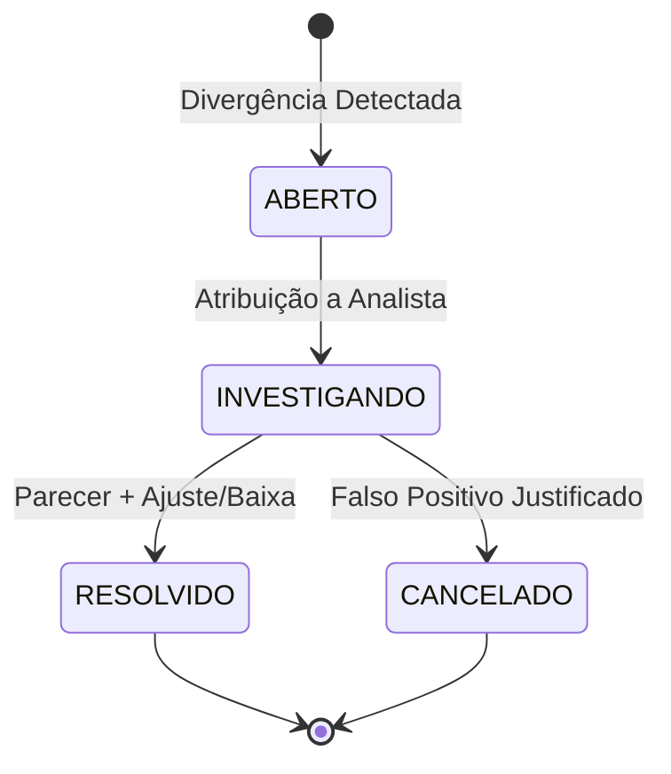

# EDDIE 11.20 — WORKSTATION DE CONCILIAÇÃO ENTERPRISE E GESTÃO DE CASOS

> **Data de Homologação:** 25 de Setembro de 2026  
> **Status:** HOMOLOGADO & AUDITADO  
> **Módulos:** `financeiro` (Control Tower)  
> **Arquivos-Chave:** [`control-tower.types.ts`](file:///C:/Users/vinad/OneDrive/Desktop/EDDIE/apps/api/src/modules/financeiro/control-tower.types.ts), [`control-tower.service.ts`](file:///C:/Users/vinad/OneDrive/Desktop/EDDIE/apps/api/src/modules/financeiro/control-tower.service.ts)

---

## 1. Visão Geral da Workstation Enterprise

A Workstation de Conciliação Enterprise e Gestão de Casos Financeiros do **EDDIE 11.20** é a ferramenta central de operação para o time de tesouraria e auditoria contábil da DiskIngressos. Ela transforma a detecção de inconsistências (originada na Conciliação 6 Vias do EDDIE 11.19) em uma esteira operacional estruturada, com atribuição de responsáveis, preservação de evidências e workflow de resolução formal.

---

## 2. Tipologia de Divergências Financeiras

As divergências tratadas pela workstation categorizam-se de acordo com as pontas do ecossistema:

| Tipo | Origem | Impacto | Severidade Padrão |
|---|---|---|---|
| **GATEWAY_VS_ADQUIRENTE** | Transação aprovada no Gateway sem repasse registrado pela credenciadora/adquirente. | Risco de perda de receita ou falha de captura. | **ALTO** |
| **GATEWAY_VS_LEDGER** | Venda capturada no gateway sem lançamento no Livro-Razão (`lancamentoLedger`). | Furo contábil e descompasso no saldo do evento. | **CRITICO** |
| **BANCO_VS_CNAB** | Retorno bancário apontando rejeição de lote PIX ou TED de repasse. | Produtor não recebe repasse no prazo agendado. | **ALTO** |
| **CHARGEBACK_NAO_PROVISIONADO** | Chargeback recebido após esgotamento da reserva de contingência do evento. | Risco de saldo a descoberto da DiskIngressos. | **CRITICO** |
| **DISCREPANCIA_TAXA** | Divergência entre a taxa contratada no snapshot e o valor deduzido no fechamento. | Questionamento comercial pelo produtor. | **MEDIO** |
| **DESENCONTRO_TEMPORAL** | Transação compensada com D+1 além do prazo regulamentar. | Flutuação temporária no fluxo de caixa. | **BAIXO** |

---

## 3. Ciclo de Vida do Caso Financeiro

Todo caso financeiro segue uma máquina de estados estrita:



### 3.1 Estados
1. **`ABERTO`:** O caso foi registrado automaticamente por rotina de conciliação ou aberto manualmente por operador. Fila de triagem prioritária.
2. **`INVESTIGANDO`:** Um analista ou auditor assumiu a titularidade do caso, anexou logs de adquirentes e está em contato com o banco/suporte.
3. **`RESOLVIDO`:** O caso foi formalmente concluído. Caso tenha havido erro de liquidação, um lançamento compensatório auditável é registrado no Ledger.
4. **`CANCELADO`:** Caso classificado como inconsistência superada (ex: liquidação bancária noturna em D+1 regularizada automaticamente) com justificativa registrada.

---

## 4. Mecanismo de Matching Enterprise

A Workstation disponibiliza a conciliação assistida e o emparelhamento manual de transações não correspondidas:

### 4.1 Matching Automático Heurístico
- **Critérios de Tolerância:**
  - Tolerância de valor: até R$ 0,05 para divergências de arredondamento de centavos de MDR.
  - Janela de data: D-0 a D+2 para compensações interbancárias (CIP/STR).
  - NSU / Código de Autorização: match exato de identificadores do adquirente.

### 4.2 Matching Manual na Workstation
Para transações com inconsistência cadastral ou quebra de lote bancário:
1. O operador visualiza as pontas não conciliadas lado a lado.
2. Seleciona o par correspondente e submete o vínculo com justificativa.
3. Se houver diferença monetária, o sistema exige aprovação de alçada do Supervisor antes de gerar qualquer compensação contábil.

---

## 5. Resolução com Preservação da Cadeia de Custódia

A resolução de um caso de divergência é um ato formal que exige:
- **`resolutionNotes`:** Justificativa técnica circunstanciada descrevendo a causa raiz e a providência tomada.
- **`resolvedBy`:** Identificação do auditor ou supervisor responsável.
- **Evidências Digitais:** Hash de arquivos de extrato bancário, logs de webhook de gateway ou comprovantes de transferência anexados.

No código do serviço:
```typescript
item.status = 'RESOLVIDO';
item.resolutionNotes = resolutionNotes;
item.resolvedBy = actorId;
item.resolvedAt = new Date().toISOString();
item.auditLog.push({
  action: 'RESOLVER_CASO',
  actorId,
  timestamp: item.resolvedAt,
  details: resolutionNotes,
});
```

---

## 6. Evidências de Testes Automatizados

A eficácia e a conformidade da Workstation foram comprovadas nos seguintes cenários automatizados em [`control-tower.spec.ts`](file:///C:/Users/vinad/OneDrive/Desktop/EDDIE/apps/api/src/modules/financeiro/control-tower.spec.ts):
- **Cenário 14:** Listagem de casos por status e severidade com cálculo correto de KPIs.
- **Cenário 15:** Atualização de status para `INVESTIGANDO` e atribuição de responsável.
- **Cenário 16:** Resolução auditada de caso com justificativa e preservação do log imutável.
- **Cenário 17:** Execução de matching manual na Workstation de Conciliação com validação de parâmetros.

**Taxa de Sucesso:** 100% de testes aprovados.
