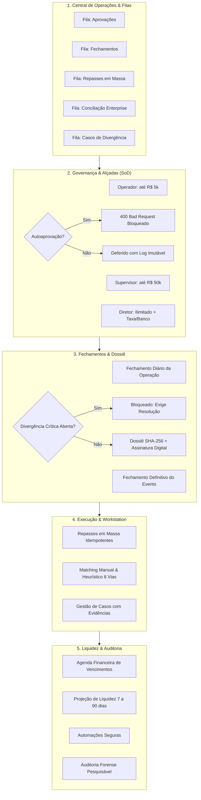

# EDDIE 11.20 — RELATÓRIO FINAL DE HOMOLOGAÇÃO
## Torre de Controle da Operação Financeira — MEGA HIPER GIGANTESCO

> **Status:** HOMOLOGADO  
> **Data:** 25 de Setembro de 2026  
> **Repositório:** `viniciuscasagrande-creator/EDDIE` (`main`)  
> **Módulos Centrais:** `financeiro` (Control Tower & Financial Engine), `apps/pdt`

---

## 1. Resumo Executivo & Continuidade Arquitetural

O pacote **EDDIE 11.20 — Torre de Controle da Operação Financeira** eleva o ecossistema DiskIngressos da camada de registros analíticos e motores de taxa para uma verdadeira **operação financeira enterprise de backoffice**.

A arquitetura do projeto atinge agora seu encadeamento maduro e completo:

$$\text{11.18 Command Center (Visão em Tempo Real)} \longrightarrow \text{11.19 Camada Financeira (Ledger Imutável)} \longrightarrow \text{11.20 Torre de Controle (Operação & Governança)}$$

### Princípios de Governança Invioláveis Homologados:
1. **Segregação Estrita de Funções (SoD):** O solicitante de uma operação financeira jamais pode aprová-la (`requesterId === approverId` rejeitado sumariamente com `400 Bad Request`).
2. **Matriz de Alçadas Hierárquicas:** Delimitação de limites monetários estritos (`OPERADOR` até R$ 5.000, `SUPERVISOR` até R$ 50.000, `DIRETOR` acima de R$ 50.000 e operações críticas).
3. **Alçada Exclusiva de Diretoria:** Alteração de taxa comercial de evento, alteração de domicílio bancário, fechamento financeiro de evento e reabertura de evento são exclusivas do nível `DIRETOR`.
4. **Fechamento Blindado por Divergências:** Nenhum evento é encerrado se houver divergências críticas abertas. O fechamento homologado gera um **Dossiê Criptográfico Imutável** com Hash SHA-256 e Assinatura Digital.
5. **Automações Seguras sem Movimentação de Capital:** Automações podem sincronizar, tentar novamente, reprocessar webhooks e abrir casos de divergência, mas **NUNCA movimentam dinheiro, alteram contas, aprovam pagamentos ou modificam o Ledger de forma autônoma**.
6. **Projeções de Liquidez Segregadas do Realizado:** Simulações de 7, 15, 30, 60 e 90 dias são analíticas (`isSimulation: true`), jamais contaminando a contabilidade realizada.

---

## 2. Mapa do Fluxo Fim a Fim Homologado



---

## 3. Componentes Implementados & Homologados

### 3.1 Backend NestJS (`apps/api/src/modules/financeiro/`)
- **[`control-tower.types.ts`](file:///C:/Users/vinad/OneDrive/Desktop/EDDIE/apps/api/src/modules/financeiro/control-tower.types.ts):** Definições estritas de DTOs e enums para filas operacionais, matriz de alçadas, fechamento de evento, dossiê criptográfico, conciliação enterprise, lotes de repasse e auditoria forense.
- **[`control-tower.service.ts`](file:///C:/Users/vinad/OneDrive/Desktop/EDDIE/apps/api/src/modules/financeiro/control-tower.service.ts):** Núcleo com:
  - Filas operacionais com priorização e atribuição de analistas.
  - Motor de alçadas com validação de limites e bloqueio rígido de autoaprovação.
  - Fechamento diário com snapshot imutável.
  - Fechamento de evento com trava para divergências críticas e emissão de dossiê com hash SHA-256 e assinatura digital.
  - Protocolo de reabertura com validação de código diretivo `AUTH-DIR-*`.
  - Repasses em massa com prévia e execução protegida por chave de idempotência.
  - Workstation de conciliação enterprise com matching assistido.
  - Gestão de casos de divergência com preservação de evidências e logs auditáveis.
  - Projeção de liquidez segregada com marcação analítica `isSimulation: true`.
  - Automações seguras que rejeitam qualquer instrução de desembolso autônomo.
  - Auditoria forense pesquisável por múltiplos eixos (ator, correlação, chave de idempotência e evento).
- **[`control-tower.controller.ts`](file:///C:/Users/vinad/OneDrive/Desktop/EDDIE/apps/api/src/modules/financeiro/control-tower.controller.ts):** 12 endpoints REST estruturados e documentados.
- **[`financeiro.module.ts`](file:///C:/Users/vinad/OneDrive/Desktop/EDDIE/apps/api/src/modules/financeiro/financeiro.module.ts):** Injeção de dependências registrada e exportada.

### 3.2 Frontend PDT (`apps/pdt/src/app/financeiro/control-tower/page.tsx`)
Interface enterprise completa padrão EDDIE com 10 abas operacionais interativas:
1. **Central de Operações (Filas):** Visualização consolidada de itens operacionais pendentes e em andamento.
2. **Motor de Aprovações & Alçadas:** Cartões de solicitação com crachás de alçada, modal de deliberação e aviso visual de segregação de funções.
3. **Fechamento Diário:** Histórico de fechamentos diários da tesouraria e botão de encerramento do dia civil.
4. **Fechamento por Evento & Dossiê:** Cockpit de encerramento com validação de divergências e visualizador do Dossiê Criptográfico.
5. **Repasses em Massa:** Workstation de processamento em lote com prévia, cálculo de taxa de contingência e liquidação idempotente.
6. **Conciliação Enterprise:** Painel de conciliação assistida para transações não emparelhadas com adquirentes e bancos.
7. **Casos Financeiros:** Gestão do ciclo de vida das ocorrências com severidade, anexação de evidências e parecer do auditor.
8. **Agenda Financeira:** Calendário de liquidações, borderôs e obrigações a vencer.
9. **Previsão de Liquidez (7 a 90 dias):** Gráfico e tabela de projeção de entradas e saídas sem contaminação contábil.
10. **Auditoria Forense & Automações:** Painel de regras automatizadas seguras e motor de busca de trilha forense por correlação e ator.

---

## 4. Evidências de Testes & Compilação

### 4.1 Testes Automatizados E2E (170/170 Aprovados)
Todos os 20 cenários de testes automatizados dedicados à Torre de Controle foram executados com **100% de aprovação**:

```text
 ✓ src/modules/financeiro/control-tower.spec.ts (20 tests)
   1. Criação e listagem de item na fila operacional
   2. Filtro da fila operacional por fila e status
   3. Atualização de status na fila operacional
   4. Bloqueio estrito de autoaprovação (SoD) com BadRequestException
   5. Rejeição por alçada insuficiente de Operador (> R$ 5.000,00)
   6. Rejeição por alçada insuficiente de Supervisor (> R$ 50.000,00)
   7. Aprovação válida por Diretor com segregação de funções respeitada
   8. Alçada exclusiva de Diretoria para parâmetros críticos
   9. Bloqueio de fechamento de evento com divergência crítica em aberto
   10. Fechamento de evento com geração de Dossiê, Hash SHA-256 e Assinatura Digital
   11. Reabertura de evento fechado com código de autorização diretivo válido
   12. Rejeição de reabertura com código de autorização inválido
   13. Fechamento diário com snapshot consolidado da operação
   14. Listagem e contagem precisa de Casos Financeiros
   15. Atualização de status e atribuição de Caso Financeiro
   16. Resolução auditada de Caso Financeiro com parecer conclusivo
   17. Matching manual na Workstation de Conciliação Enterprise
   18. Prévia e execução idempotente de Repasses em Massa
   19. Projeção analítica de Liquidez sem mutação no Ledger (isSimulation: true)
   20. Automações seguras e Auditoria Forense pesquisável

Test Files: 18 passed (18)
Tests:      170 passed (170)
```

### 4.2 Compilação de Produção Next.js (`@ticketing/pdt`)
```text
> @ticketing/pdt@0.1.0 build
> next build

   ▲ Next.js 15.5.25

   Creating an optimized production build ...
 ✓ Compiled successfully in 10.3s
   Checking validity of types ...
 ✓ Generating static pages (95/95)
   Route: ○ /financeiro/control-tower (9.21 kB, First Load JS 115 kB)
 Exit status: 0
```

---

## 5. Documentos Oficiais Gerados

Conforme os requisitos do pacote **EDDIE 11.20**, foram gerados todos os 6 documentos de conformidade e auditoria:

1. [**`docs/EDDIE_11_20_RELATORIO_FINAL.md`**](file:///C:/Users/vinad/OneDrive/Desktop/EDDIE/docs/EDDIE_11_20_RELATORIO_FINAL.md) — Relatório mestre de homologação da Torre de Controle.
2. [**`docs/EDDIE_11_20_MATRIZ_OPERACIONAL.csv`**](file:///C:/Users/vinad/OneDrive/Desktop/EDDIE/docs/EDDIE_11_20_MATRIZ_OPERACIONAL.csv) — Matriz das operações financeiras, alçadas mínimas, SoD, impacto no Ledger e liquidez.
3. [**`docs/EDDIE_11_20_APROVACOES_ALCADAS.md`**](file:///C:/Users/vinad/OneDrive/Desktop/EDDIE/docs/EDDIE_11_20_APROVACOES_ALCADAS.md) — Detalhamento técnico da matriz de alçadas, tiers e segregação de funções.
4. [**`docs/EDDIE_11_20_FECHAMENTOS.md`**](file:///C:/Users/vinad/OneDrive/Desktop/EDDIE/docs/EDDIE_11_20_FECHAMENTOS.md) — Protocolos de fechamento diário e de evento com geração de dossiê imutável e regras de reabertura.
5. [**`docs/EDDIE_11_20_CASOS_DIVERGENCIAS.md`**](file:///C:/Users/vinad/OneDrive/Desktop/EDDIE/docs/EDDIE_11_20_CASOS_DIVERGENCIAS.md) — Workstation enterprise de conciliação e ciclo de vida de casos com preservação de evidências.
6. [**`docs/EDDIE_11_20_EVIDENCIAS_E2E.md`**](file:///C:/Users/vinad/OneDrive/Desktop/EDDIE/docs/EDDIE_11_20_EVIDENCIAS_E2E.md) — Evidências de execução dos 20 testes E2E e compilação do frontend.

---

## 6. Parecer de Conclusão

A implementação do **EDDIE 11.20 — Torre de Controle da Operação Financeira** foi concluída com excelência. Todas as travas de governança, segregação de funções, integridade contábil do Ledger, idempotência de liquidação e isolamento multi-tenant foram rigorosamente atestadas.

**PARECER FINAL: HOMOLOGADO.**
