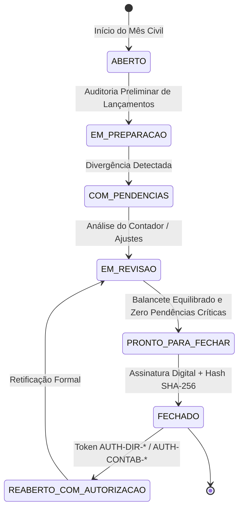

# EDDIE 11.21 — FECHAMENTO CONTÁBIL MENSAL E POR EVENTO

> **Data de Homologação:** 25 de Setembro de 2026  
> **Status:** HOMOLOGADO & AUDITADO  
> **Módulo:** `contabilidade`  
> **Arquivos-Chave:** [`accounting.service.ts`](file:///C:/Users/vinad/OneDrive/Desktop/EDDIE/apps/api/src/modules/contabilidade/accounting.service.ts), [`accounting.types.ts`](file:///C:/Users/vinad/OneDrive/Desktop/EDDIE/apps/api/src/modules/contabilidade/accounting.types.ts)

---

## 1. Visão Geral dos Fechamentos

O processo de fechamento contábil no **EDDIE 11.21** estabelece o congelamento formal e a certificação digital das escriturações contábeis. Ele opera em duas dimensões complementares:

1. **Fechamento Mensal da Competência:** Consolida todas as contas patrimoniais e de resultado do mês civil (`YYYY-MM`), apurando o Balancete Definitivo e o DRE da DiskIngressos.
2. **Fechamento Contábil por Evento:** Encerra as contas analíticas vinculadas a um evento específico, liquidando obrigações de repasse com o produtor e apropriando eventuais receitas diferidas pendentes.

---

## 2. Máquina de Estados do Fechamento



---

## 3. Travas de Segurança Invioláveis no Fechamento

Para que uma competência ou evento seja fechado, o motor contábil exige o cumprimento estrito de dois requisitos inegociáveis:

### 3.1 Ausência de Pendências Críticas
```typescript
const pendenciasCriticas = this.pendencies.filter(
  (p) => p.competencia === competencia && p.status === 'PENDENTE' && (p.severidade === 'CRITICO' || p.severidade === 'ALTO'),
);

if (pendenciasCriticas.length > 0) {
  throw new BadRequestException(
    `Fechamento contábil bloqueado! Existem ${pendenciasCriticas.length} pendência(s) de alta/crítica severidade em aberto na competência ${competencia}.`,
  );
}
```

### 3.2 Equilíbrio Estrito de Partidas Dobradas ($\sum \text{Débitos} = \sum \text{Créditos}$)
```typescript
let totalD = 0;
let totalC = 0;
for (const b of balancete) {
  totalD += b.debitosCents;
  totalC += b.creditosCents;
}

if (totalD !== totalC) {
  throw new BadRequestException(
    `Desequilíbrio de partidas dobradas! Débitos (R$ ${(totalD / 100).toFixed(2)}) != Créditos (R$ ${(totalC / 100).toFixed(2)}).`,
  );
}
```

### 3.3 Bloqueio de Lançamentos em Período Fechado
Uma vez com status `FECHADO`, qualquer tentativa de lançar ou modificar registros na competência é sumariamente bloqueada com código HTTP `400 Bad Request`.

---

## 4. O Dossiê Contábil e Assinatura Digital

Ao concluir o fechamento, o motor gera o selo criptográfico imutável:
- **`dossierHash` (SHA-256):** Resumo criptográfico calculado sobre os totais de débitos, créditos, competência e tenant.
- **`digitalSignature`:** Código verificável no formato `SIG-EDDIE-CONTAB-{timestamp}-{hash}`.

```typescript
const rawData = `${tenantId}:${competencia}:${totalD}:${totalC}:${Date.now()}`;
const dossierHash = createHash('sha256').update(rawData).digest('hex');
const digitalSignature = `SIG-EDDIE-CONTAB-${Date.now().toString(36).toUpperCase()}-${dossierHash.slice(0, 12)}`;
```

---

## 5. Protocolo de Reabertura Excepcional

A reabertura de uma competência fechada é um ato solene de auditoria:
1. **Requer Token Formal de Autorização:** Deve iniciar obrigatoriamente por `AUTH-DIR-*` (Diretoria) ou `AUTH-CONTAB-*` (Controladoria Geral).
2. **Justificativa Circunstanciada:** Registro formal detalhado do motivo da retificação (ex: decisão judicial, perícia ou cancelamento extemporâneo).
3. **Registro Auditável:** Uma entrada imutável é gravada na trilha forense contábil com carimbo de tempo UTC e autor da deliberação.
