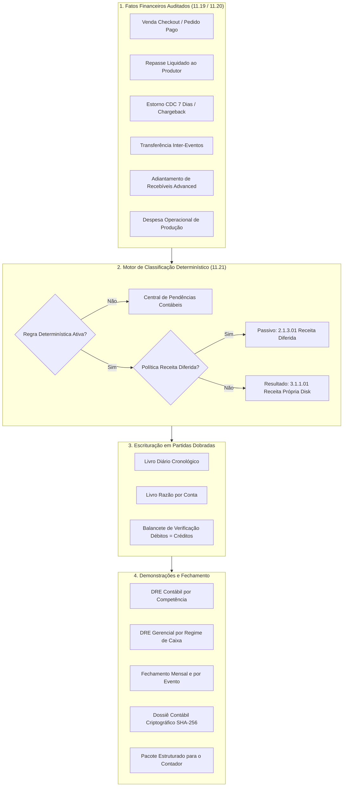

# EDDIE 11.21 — MAPA CONTÁBIL E ARQUITETURA DE INTERMEDIAÇÃO

> **Data de Homologação:** 25 de Setembro de 2026  
> **Status:** HOMOLOGADO & AUDITADO  
> **Módulos:** `contabilidade` (Accounting & Fiscal Intelligence OS), `financeiro` (11.19 / 11.20)  
> **Normas de Referência:** CPC 47 / IFRS 15 (Receita de Contrato com Cliente — Intermediação de Terceiros)

---

## 1. Visão Geral da Arquitetura Contábil

O módulo **EDDIE 11.21 — Accounting & Fiscal Intelligence OS** estabelece a camada de inteligência contábil e fiscal do ecossistema DiskIngressos. Diferente de sistemas tradicionais que duplicam bases de dados, o 11.21 **não cria um segundo Livro-Razão financeiro**: ele atua como o motor de tradução e escrituração que transforma os fatos econômicos auditados do **11.19** e **11.20** em escrituração contábil em partidas dobradas rigorosas.

---

## 2. Princípio Inviolável da Intermediação (CPC 47 / IFRS 15)

Na venda de ingressos, a DiskIngressos atua como intermediadora de tecnologia e bilheteria entre o comprador final e o produtor do espetáculo. Portanto:

1. **O valor bruto dos ingressos vendidos NUNCA é reconhecido como receita própria da DiskIngressos.**
2. O valor do ingresso pertence integralmente ao produtor e transita no Passivo Circulante (`2.1.2.01 Valores a Repassar a Produtores de Eventos`).
3. Somente a **taxa de conveniência/serviço** acordada contratualmente compõe o Resultado da DiskIngressos (`3.1.1.01 Receita Própria de Taxa de Conveniência`).
4. Os **repasses bancários** aos produtores são baixas de obrigações do passivo contra saídas bancárias (`1.1.1.01 Disponibilidades em Bancos`), gerando **ZERO impacto** nas receitas ou despesas da Disk.
5. As **transferências de saldo inter-eventos** do mesmo produtor ajustam as subcontas de passivo dos respectivos eventos, sem gerar qualquer mutação em receitas.

---

## 3. Matriz de Contas e Partidas Dobradas

| Fato Econômico | Conta Débito | Conta Crédito | Efeito Contábil |
|---|---|---|---|
| **Venda de Ingresso (R$ 100)**   *(R$ 90 produtor + R$ 10 Disk)* | `1.1.2.01` Adquirentes a Receber (R$ 100) | `2.1.2.01` Valores a Repassar (R$ 90)   `3.1.1.01` Receita Própria Disk (R$ 10) | Ativo $\uparrow$ R$ 100   Passivo $\uparrow$ R$ 90   Receita $\uparrow$ R$ 10 |
| **Venda com Receita Diferida**   *(Evento futuro configurado)* | `1.1.2.01` Adquirentes a Receber (R$ 100) | `2.1.2.01` Valores a Repassar (R$ 90)   `2.1.3.01` Receitas Diferidas (R$ 10) | Ativo $\uparrow$ R$ 100   Passivo $\uparrow$ R$ 90   Passivo $\uparrow$ R$ 10 (Sem receita imediata) |
| **Apropriação por Competência**   *(Realização do Evento)* | `2.1.3.01` Receitas Diferidas (R$ 10) | `3.1.1.01` Receita Própria Disk (R$ 10) | Passivo $\downarrow$ R$ 10   Receita $\uparrow$ R$ 10 |
| **Repasse Bancário ao Produtor**   *(Liquidação PIX / CNAB)* | `2.1.2.01` Valores a Repassar (R$ 90) | `1.1.1.01` Disponibilidades Bancárias (R$ 90) | Passivo $\downarrow$ R$ 90   Ativo $\downarrow$ R$ 90   *(ZERO impacto em Resultado)* |
| **Estorno de Ingresso CDC 7 Dias** | `2.1.2.01` Valores a Repassar (R$ 90)   `3.1.1.01` Receita Própria Disk (R$ 10) | `1.1.2.01` Adquirentes a Receber (R$ 100) | Passivo $\downarrow$ R$ 90   Receita $\downarrow$ R$ 10   Ativo $\downarrow$ R$ 100 |
| **Chargeback Recebido** | `2.1.5.01` Reserva para Disputas (R$ 90)   `3.1.1.01` Receita Própria Disk (R$ 10) | `1.1.2.01` Adquirentes a Receber (R$ 100) | Passivo $\downarrow$ R$ 90   Receita $\downarrow$ R$ 10   Ativo $\downarrow$ R$ 100 |
| **Transferência Inter-Eventos** | `2.1.2.01` Valores a Repassar (Origem) | `2.1.2.01` Valores a Repassar (Destino) | Passivo $\Delta$ Neutro   *(ZERO receita)* |
| **Adiantamento Advanced** | `1.1.3.01` Adiantamentos Concedidos | `1.1.1.01` Disponibilidades Bancárias | Ativo Permutativo |
| **Despesa Operacional de Evento** | `4.2.1.01` Custos Diretos de Eventos | `2.1.4.01` Contas a Pagar Fornecedores | Despesa $\uparrow$   Passivo $\uparrow$ |

---

## 4. Rastreabilidade com o Ledger Financeiro (11.19)

Cada lançamento contábil gravado na tabela `contabilidade.lancamentos_contabeis` mantém rastreabilidade total:
- **`origemTipo`:** Identificador do tipo de fato (`venda_ingresso`, `repasse_produtor`, etc.).
- **`origemReferenciaId`:** Identificador universal do pedido, lote de repasse ou estorno do Ledger.
- **`correlationId`:** Código de correlação distribuído para auditoria forense.
- **`regraVersao`:** Snapshot da versão da regra determinística utilizada no ato da escrituração.

Essa arquitetura garante integridade total: o módulo 11.21 reflete a realidade econômico-financeira sem violar o isolamento modular nem permitir lançamentos duplicados ou órfãos.
