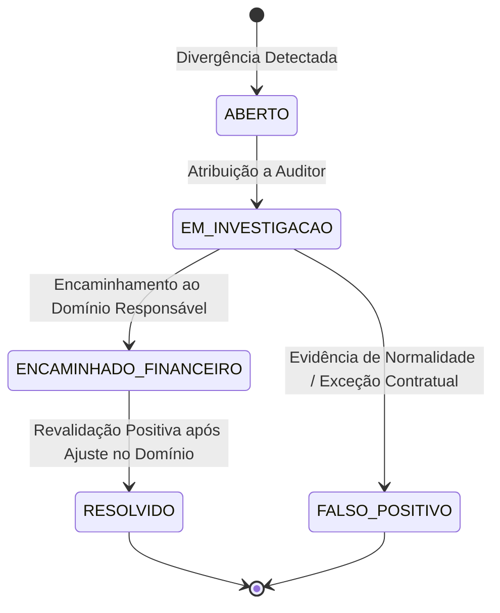

# EDDIE 11.22 — Central de Casos de Revenue Assurance & Trilha Forense

A Central de Casos do **EDDIE 11.22** gerencia todo o ciclo de vida das discrepâncias e suspeitas de vazamento de receita identificadas na cadeia transacional de 8 fontes. 

O sistema preserva a evidência criptográfica (SHA-256) no momento da detecção e encaminha o caso para investigação humana e retificação no domínio responsável (Financeiro 11.19/11.20, Portaria 11.08, Pagamentos 11.04 ou Contabilidade 11.21).

---

## 1. Ciclo de Vida do Caso de Assurance

### Regras Invioláveis do Ciclo de Vida
1. **Sem Encerramento Arbitrário:** Um caso só pode transicionar para `RESOLVIDO` se a cadeia for auditada novamente e apresentar status `INTEGRO` no domínio de origem, ou se houver justificativa formal assinada por autoridade competente.
2. **Imutabilidade da Evidência:** O snapshot original e seu hash SHA-256 nunca são alterados quando o caso é revalidado.
3. **Audit Trail Completo:** Todas as alterações de status, atribuição de operador e notas de resolução são registradas em trilha de auditoria append-only imutável.

---

## 2. Casos Registrados na Homologação

| Caso ID | Correlação | Tipo de Divergência | Severidade | Domínio Responsável | Montante | Status | Hash SHA-256 (Evidência) |
|---|---|---|---|---|---|---|---|
| `case-ra-01` | `corr-live-849050` | `PEDIDO_SEM_LEDGER` | `CRITICO` | `FINANCEIRO` | R$ 150,00 | `ABERTO` | `5e884898da28047151d0e56f8dc6292773603d0d6aabbdd62a11ef721d1542d8` |
| `case-ra-02` | `corr-live-849040` | `BANCO_DIVERGENTE` | `ALTO` | `TESOURARIA` | R$ 80,00 | `EM_INVESTIGACAO` | `4b227777d4dd1fc61c6f884f48641d02b4d121d3fd328cb08b5531fcacdabf8a` |
| `case-ra-03` | `corr-live-849010` | `TAXA_PERCENTUAL_INCORRETA` | `ALTO` | `FINANCEIRO` | R$ 20,00 | `ENCAMINHADO_FINANCEIRO` | `2c624232cdd221771294dfbb379ac8ab007c07931b63c73a609ddf150a00865d` |
| `case-ra-04` | `corr-live-848990` | `PEDIDO_SEM_INGRESSO` | `ALTO` | `INGRESSOS` | R$ 120,00 | `EM_INVESTIGACAO` | `0497554f7a77e80ec19b441f5a2e57fa23e01dd3a7a9152b12cf9cf399450379` |
| `case-ra-05` | `corr-live-848980` | `PEDIDO_SEM_LEDGER` | `CRITICO` | `FINANCEIRO` | R$ 100,00 | `RESOLVIDO` | `0cf06c09772ae870196238b7da9df95e9ff9797089b33a5cf051cd72ecb77f19` |

---

## 3. Detalhamento dos Casos de Teste E2E

### Caso #1: Venda Confirmada sem Entrada no Ledger (`PEDIDO_SEM_LEDGER`)
- **Origem:** Gateway confirmou recebimento de R$ 150,00, mas processo assíncrono de outbox falhou antes de gravar no bucket retido do Ledger 11.19.
- **Detecção:** Regra `RA_ORDER_LEDGER` disparada pelo scan incremental.
- **Evidência Registrada:** CorrelationId `corr-live-849050`, OrderId `ped-849050`, PaymentId `pay-849050`, GatewayNSU `nsu-stone-99125`.
- **Encaminhamento:** Fila operacional de incidentes financeiros 11.20.

### Caso #2: Retorno Bancário com Rejeição de Payout (`BANCO_DIVERGENTE`)
- **Origem:** Arquivo de retorno bancário acusou chave PIX inválida para repasse de R$ 80,00.
- **Detecção:** Regra `RA_BANK_RECONCILIATION` identificou divergência entre o lote liquidado no Settlement e a confirmação bancária.
- **Evidência Registrada:** SettlementId `stl-849040`, Retorno `RET-REJEITADO-040`.
- **Ação:** O saldo não foi estornado indevidamente; caso encaminhado à Tesouraria para validação cadastral com o produtor.

### Caso #3: Revalidação com Fechamento de Caso
- **Cenário:** O domínio financeiro identificou a causa raiz e executou a compensação formal com registro no Ledger (`led-corrigido-20`).
- **Ação do 11.22:** Chamada do endpoint `POST /api/revenue-assurance/cases/:id/revalidate`.
- **Resultado:** A reauditoria da cadeia confirmou o status `INTEGRO`. O caso foi transicionado para `RESOLVIDO` e registrado na trilha de auditoria.
