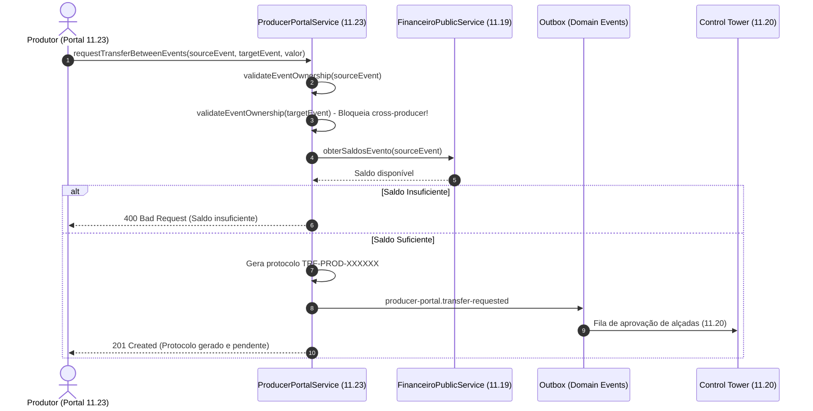

# EDDIE 11.23 — Mapa de Dados & Fluxos de Informação Financeira

Este documento detalha o mapeamento de origem, trânsito e consumo de dados financeiros no **Portal do Produtor (EDDIE 11.23)**, comprovando a aderência ao monólito modular event-driven e a preservação da verdade financeira centralizada no **EDDIE 11.19**.

---

## 1. Origem Canônica de Dados por Funcionalidade

| Seção do Portal | Dado Exibido | Módulo de Origem | Porta Pública Consumida |
|---|---|---|---|
| **Início Financeiro** | Saldo Disponível, Retido, Reservado e Contábil | `financeiro` (11.19) | `FinanceiroPublicService.obterSaldosProdutor` |
| **Saldos por Evento** | Saldo individual por evento e receita bruta | `financeiro` (11.19) | `FinanceiroPublicService.obterSaldosEvento` |
| **Extrato do Evento** | Lançamentos analíticos em partidas dobradas | `financeiro` (11.19) | `FinanceiroPublicService.obterExtratoLedgerParaContabilidade` |
| **Taxas Negociadas** | Modelo (Fixa/%), vigência e snapshots aplicados | `financeiro` (11.19) | `FinancialEngineService.getFeeConfig` |
| **Agenda de Repasses** | Lotes de repasse agendados e status de payout | `financeiro` (11.20) | `FinancialEngineService.getSettlementLots` |
| **Comprovantes** | Autenticação bancária e código de liquidação | `tesouraria` (11.20) | `FinancialEngineService.getSettlementLots` |
| **Transferências** | Solicitação de remanejamento entre eventos | `producer-portal` (11.23) $\to$ `11.20` | `OutboxService` (`producer-portal.transfer-requested`) |
| **Estornos** | Dedução do bucket de Reserva de Estorno | `estorno` (11.02) $\to$ `11.19` | `FinancialEngineService.getRefundRecords` |
| **Chargebacks** | Notificações bancárias e prazos de contestação | `financeiro` (11.19) | `FinancialEngineService.getChargebackRecords` |
| **Fluxo de Caixa** | Realizado (Ledger) vs Projetado (D+30 / Agenda) | `financeiro` (11.19) | Agregação segregada 11.19 |
| **DRE Gerencial** | Receitas, taxas e despesas cadastradas | `financeiro` (11.19) | `FinancialEngineService.getEventDre` |
| **Dados Bancários** | Agência, conta e chave PIX mascarados | `financeiro` (11.20) | `FinancialEngineService.getTreasuryAccounts` |
| **Central de Chamados** | Protocolos, tickets e timeline de status | `producer-portal` (11.23) | `ProducerPortalService.requestsStore` |

---

## 2. Fluxo de Transferência entre Eventos Próprios

---

## 3. Isolamento Estrito de Cache & Multi-Tenant

Para impedir que dados de um produtor fiquem visíveis para outro em ambientes com cache ativado (ex: Vercel Edge, Redis, CDN):
- Todas as chaves de cache são prefixadas obrigatoriamente por `tenantId` e `producerId`:
  $$\text{Key} = \texttt{tenantId}:\texttt{producerId}:\texttt{resourceName}$$
- Nenhuma resposta de cache do Produtor A é retornada para o Produtor B, mesmo que ambos acessem o mesmo endpoint com os mesmos parâmetros de período.
